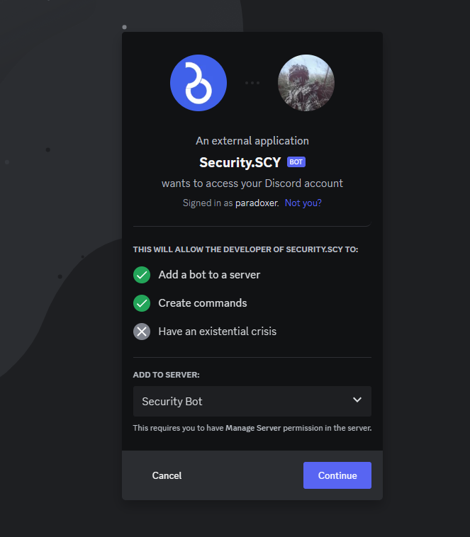

# 🛠 Getting Started

## Step 1 - Adding Bot To your server.


```
https://discord.com/api/oauth2/authorize?client_id=1160147705163681872&permissions=8&scope=bot
```


<figure><figcaption></figcaption></figure>


Note: This permissions are requeired for bot to work properly.


## Step 2 - Executing first commands.

<figure><figcaption></figcaption></figure>

This is core bots commands shows all commands open for  this bot\



Normal tutorial is done! Moving to another stage ( Perfomance & Features )&#x20;

